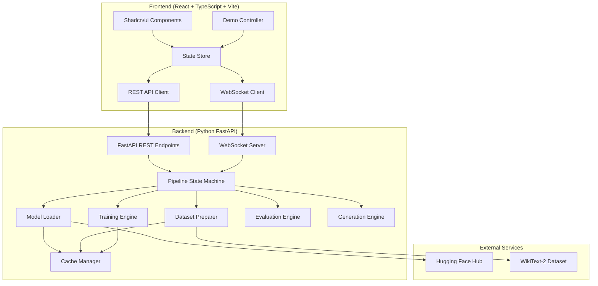
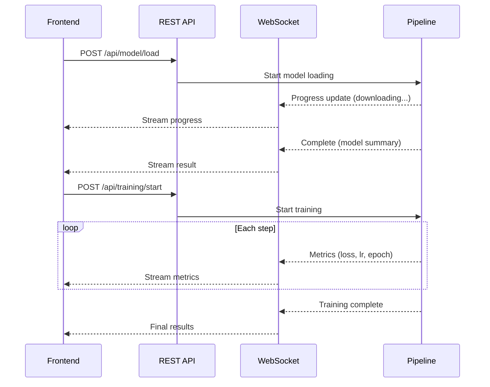
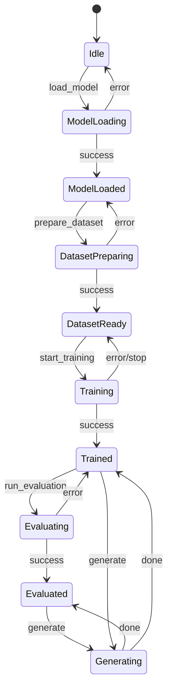

# Design Document: GPT Text Generator

## Overview

This application is a full-stack educational tool that lets users build, train, and test a GPT-2 text generator through a web interface. The system consists of a React/TypeScript frontend communicating with a Python FastAPI backend over REST and WebSocket. The backend handles all ML operations (model loading, dataset preparation, training, evaluation, text generation) using Hugging Face Transformers and PyTorch. The frontend provides real-time visualization of training progress, interactive text generation, and an automated demo mode with educational commentary.

The key architectural driver is the long-running nature of ML operations. Training can take minutes, so the system uses WebSocket for streaming progress updates and a state machine on the backend to track pipeline stages. A demo orchestrator automates the full pipeline with narration and visual highlights.

## Architecture



### Communication Flow



### Design Decisions

1. **WebSocket for all long-running ops**: REST endpoints initiate operations, WebSocket streams progress. This avoids polling and gives sub-second UI updates.
2. **Pipeline state machine**: A single state machine tracks the current pipeline stage, preventing conflicting operations (e.g., can't evaluate before training).
3. **Hugging Face Trainer API**: Using the built-in `Trainer` class rather than a custom training loop. This gives us checkpointing, logging callbacks, and gradient accumulation for free.
4. **File-based caching**: Models and datasets are cached to the local filesystem via Hugging Face's built-in cache. Checkpoints are saved per-epoch.
5. **Single WebSocket connection**: One persistent connection per client handles all event types, distinguished by message type field.

## Components and Interfaces

### Backend Components

#### FastAPI Application (`main.py`)
- Mounts REST routes and WebSocket endpoint
- CORS middleware for frontend dev server
- Lifespan handler for startup/shutdown

#### REST API Endpoints
| Endpoint | Method | Description |
|---|---|---|
| `/api/model/load` | POST | Initiate model + tokenizer loading |
| `/api/model/summary` | GET | Get loaded model architecture summary |
| `/api/dataset/prepare` | POST | Initiate dataset download + preparation |
| `/api/dataset/stats` | GET | Get dataset statistics |
| `/api/training/start` | POST | Start training with config |
| `/api/training/stop` | POST | Gracefully stop training |
| `/api/evaluation/run` | POST | Run evaluation on validation set |
| `/api/generation/generate` | POST | Generate text from prompt |
| `/api/generation/compare` | POST | Generate from both baseline and trained |
| `/api/demo/start` | POST | Start automated demo mode |
| `/api/demo/pause` | POST | Pause demo |
| `/api/demo/resume` | POST | Resume demo |
| `/api/demo/skip` | POST | Skip current demo step |
| `/api/status` | GET | Get current pipeline state |

#### WebSocket Messages (Server → Client)
```typescript
type WSMessage = {
  type: "progress" | "metrics" | "commentary" | "error" | "state_change" | "demo_step";
  payload: Record<string, unknown>;
  timestamp: string;
};
```

#### Pipeline State Machine


#### Model Loader (`model_loader.py`)
- `load_model() -> ModelSummary`: Downloads/caches GPT-2 small, returns architecture summary
- `load_tokenizer() -> TokenizerInfo`: Initializes tokenizer, returns vocab info and examples
- Uses `transformers.AutoModelForCausalLM` and `AutoTokenizer`

#### Dataset Preparer (`dataset_preparer.py`)
- `prepare_dataset(tokenizer, block_size=128) -> DatasetStats`: Downloads WikiText-2, tokenizes, creates train/val splits
- `TextDataset` class: Tokenizes corpus, chunks into fixed-length sequences
- Uses `datasets.load_dataset("wikitext", "wikitext-2-raw-v1")`

#### Training Engine (`training_engine.py`)
- `start_training(model, dataset, config, callback) -> TrainingResult`: Runs training via Hugging Face `Trainer`
- `TrainingConfig`: Dataclass for hyperparameters (lr, batch_size, epochs, warmup_steps, weight_decay)
- Custom `TrainerCallback` subclass streams metrics via WebSocket
- Saves checkpoints per epoch

#### Evaluation Engine (`evaluation_engine.py`)
- `evaluate(model, tokenizer, val_dataset) -> EvalResult`: Calculates perplexity on validation set
- `compare_baseline(model, tokenizer, val_dataset) -> ComparisonResult`: Compares trained vs baseline perplexity

#### Generation Engine (`generation_engine.py`)
- `generate(model, tokenizer, prompt, params) -> str`: Generates text with given parameters
- `compare_generation(baseline_model, trained_model, tokenizer, prompt, params) -> CompareResult`: Side-by-side generation
- `GenerationParams`: temperature, top_k, top_p, max_length

#### Cache Manager (`cache_manager.py`)
- Wraps Hugging Face cache directory management
- Tracks checkpoint locations for resume capability
- `is_cached(resource) -> bool`, `get_cache_path(resource) -> Path`

#### Demo Orchestrator (`demo_orchestrator.py`)
- `start_demo(speed, ws_callback)`: Runs full pipeline with pauses and commentary
- `pause()`, `resume()`, `skip_step()`
- Speed settings: fast (2s pauses), medium (5s), slow (10s)
- Commentary text for each pipeline stage

### Frontend Components

#### State Management
- React context + useReducer for pipeline state
- WebSocket hook (`useWebSocket`) manages connection lifecycle, auto-reconnect with exponential backoff
- Training metrics stored in state for chart rendering

#### UI Components
| Component | Location | Description |
|---|---|---|
| `ControlPanel` | Left sidebar | Training config form, demo controls, model/dataset actions |
| `ProgressPanel` | Main area | Loss charts, LR schedule, epoch progress, ETA |
| `CommentaryPanel` | Bottom | Educational narration, step explanations |
| `GenerationPanel` | Bottom section | Prompt input, parameter controls, output display, comparison view |
| `ModelSummary` | Main area | Architecture details, parameter counts |
| `DatasetStats` | Main area | Vocab size, sequence counts, sample preview |
| `ConnectionStatus` | Top bar | WebSocket connection indicator |
| `DemoControls` | Control panel | Start/pause/resume/skip, speed selector |

#### Validation
- Zod schemas for training config validation on the frontend
- Range constraints: learning_rate (1e-6 to 1e-2), batch_size (1-64), epochs (1-20), warmup_steps (0-1000), weight_decay (0-1)
- Generation params: temperature (0.1-2.0), top_k (1-100), top_p (0.1-1.0), max_length (10-500)

## Data Models

### Backend Models (Pydantic)

```python
class TrainingConfig(BaseModel):
    learning_rate: float = 5e-5       # 1e-6 to 1e-2
    batch_size: int = 8               # 1 to 64
    num_epochs: int = 3               # 1 to 20
    warmup_steps: int = 0             # 0 to 1000
    weight_decay: float = 0.0         # 0.0 to 1.0

class GenerationParams(BaseModel):
    prompt: str
    temperature: float = 1.0          # 0.1 to 2.0
    top_k: int = 50                   # 1 to 100
    top_p: float = 1.0                # 0.1 to 1.0
    max_length: int = 100             # 10 to 500

class ModelSummary(BaseModel):
    name: str
    num_layers: int
    num_parameters: int
    hidden_size: int
    vocab_size: int

class DatasetStats(BaseModel):
    train_samples: int
    val_samples: int
    vocab_size: int
    block_size: int

class TrainingMetrics(BaseModel):
    epoch: float
    step: int
    train_loss: float
    val_loss: float | None
    learning_rate: float
    elapsed_seconds: float
    estimated_remaining_seconds: float | None

class EvalResult(BaseModel):
    perplexity: float
    val_loss: float

class ComparisonResult(BaseModel):
    baseline_perplexity: float
    trained_perplexity: float
    improvement_pct: float

class GenerationResult(BaseModel):
    text: str
    tokens_generated: int

class CompareGenerationResult(BaseModel):
    baseline_text: str
    trained_text: str
    prompt: str

class ErrorResponse(BaseModel):
    error_code: str
    message: str
    details: str | None = None

class WSMessage(BaseModel):
    type: str  # progress, metrics, commentary, error, state_change, demo_step
    payload: dict
    timestamp: str

class DemoConfig(BaseModel):
    speed: str = "medium"  # fast, medium, slow
```

### Frontend Types (TypeScript)

```typescript
interface TrainingConfig {
  learningRate: number;
  batchSize: number;
  numEpochs: number;
  warmupSteps: number;
  weightDecay: number;
}

interface GenerationParams {
  prompt: string;
  temperature: number;
  topK: number;
  topP: number;
  maxLength: number;
}

interface PipelineState {
  stage: "idle" | "model_loading" | "model_loaded" | "dataset_preparing" |
         "dataset_ready" | "training" | "trained" | "evaluating" | "evaluated" | "generating";
  isDemo: boolean;
  demoSpeed: "fast" | "medium" | "slow";
  demoPaused: boolean;
}

interface TrainingMetrics {
  epoch: number;
  step: number;
  trainLoss: number;
  valLoss: number | null;
  learningRate: number;
  elapsedSeconds: number;
  estimatedRemainingSeconds: number | null;
}
```

## Correctness Properties

*A property is a characteristic or behavior that should hold true across all valid executions of a system — essentially, a formal statement about what the system should do. Properties serve as the bridge between human-readable specifications and machine-verifiable correctness guarantees.*

### Property 1: TextDataset produces fixed-length sequences

*For any* input corpus text and block_size parameter, all sequences produced by the TextDataset class should have exactly `block_size` tokens.

**Validates: Requirements 2.3**

### Property 2: Training config validation rejects out-of-range values

*For any* hyperparameter value outside its acceptable range (learning_rate outside 1e-6 to 1e-2, batch_size outside 1-64, epochs outside 1-20, warmup_steps outside 0-1000, weight_decay outside 0-1), the validation should reject the input and return an error for the specific field.

**Validates: Requirements 3.2, 3.6**

### Property 3: Training config round-trip to training arguments

*For any* valid TrainingConfig, converting it to Hugging Face TrainingArguments and reading back the values should produce equivalent learning_rate, per_device_train_batch_size, num_train_epochs, warmup_steps, and weight_decay.

**Validates: Requirements 3.4**

### Property 4: Checkpoint saved per epoch

*For any* training run with N epochs, after training completes there should be exactly N checkpoint directories saved.

**Validates: Requirements 4.5**

### Property 5: Evaluation produces valid perplexity

*For any* trained model and validation dataset, the evaluation engine should return a perplexity value that is a positive finite number (> 0 and not infinity/NaN).

**Validates: Requirements 5.1**

### Property 6: Generation produces non-empty output for valid inputs

*For any* valid prompt (non-empty string) and valid generation parameters (temperature 0.1-2.0, top_k 1-100, top_p 0.1-1.0, max_length 10-500), the generation engine should return a non-empty string containing at least the original prompt.

**Validates: Requirements 6.2**

### Property 7: Demo executes pipeline steps in correct sequence

*For any* demo run, the sequence of steps executed should be exactly: model_loading → dataset_preparation → training_configuration → training_execution → evaluation → text_generation, with no steps skipped or reordered.

**Validates: Requirements 7.1**

### Property 8: Demo step produces commentary and highlights active component

*For any* demo step, the Demo_Orchestrator should emit a commentary message for that step and the frontend should mark the corresponding UI component as highlighted.

**Validates: Requirements 7.3, 7.4**

### Property 9: Demo pause/resume round-trip

*For any* demo in progress, pausing should stop step progression, and resuming should continue from the exact step where it was paused without repeating or skipping steps.

**Validates: Requirements 7.5**

### Property 10: WebSocket update interval

*For any* pair of consecutive progress messages during a long-running operation, the time between them should be no greater than 2 seconds.

**Validates: Requirements 8.2**

### Property 11: Cache idempotence

*For any* resource (model or dataset), loading it twice should result in the second load using the cached version without triggering a new download, and both loads should produce equivalent results.

**Validates: Requirements 10.1, 1.1**

### Property 12: Checkpoint save/load round-trip

*For any* model checkpoint saved during training, loading that checkpoint should restore a model that produces identical outputs for the same input compared to the model state at save time.

**Validates: Requirements 10.2**

### Property 13: Structured error responses

*For any* API error response from the backend, the response body should contain an `error_code` field (non-empty string) and a `message` field (non-empty string).

**Validates: Requirements 10.3, 1.6, 2.6, 5.5, 6.7**

### Property 14: Config fields have help text

*For any* configuration field or control in the UI, there should be an associated tooltip or contextual help text that is non-empty.

**Validates: Requirements 10.5**

### Property 15: Display components render all required fields

*For any* ModelSummary data, the rendered component should contain layer count, parameter count, and hidden dimensions. *For any* DatasetStats data, the rendered component should contain vocabulary size, sequence lengths, and sample count. *For any* TrainingMetrics data, the rendered component should contain learning rate, epoch progress, and estimated time remaining. *For any* EvalResult data, the rendered component should contain perplexity value and comparison data.

**Validates: Requirements 1.3, 2.4, 4.4, 5.2, 5.3**

### Property 16: Dataset split produces non-empty train and validation sets

*For any* successful dataset preparation, both the training set and validation set should contain at least one sample, and the total sample count should equal train_samples + val_samples.

**Validates: Requirements 2.2**

## Error Handling

### Backend Error Strategy

All backend errors follow a structured pattern using the `ErrorResponse` model:

```python
class ErrorResponse(BaseModel):
    error_code: str    # e.g., "MODEL_LOAD_FAILED", "TRAINING_ERROR"
    message: str       # Human-readable description
    details: str | None  # Optional technical details
```

Error categories and codes:
| Category | Error Code | Trigger |
|---|---|---|
| Model | `MODEL_LOAD_FAILED` | HF download failure, OOM |
| Model | `MODEL_NOT_LOADED` | Operation requires loaded model |
| Dataset | `DATASET_DOWNLOAD_FAILED` | Network error, dataset unavailable |
| Dataset | `DATASET_NOT_PREPARED` | Operation requires prepared dataset |
| Training | `TRAINING_ERROR` | CUDA error, NaN loss, OOM |
| Training | `TRAINING_ALREADY_RUNNING` | Duplicate start request |
| Training | `INVALID_CONFIG` | Validation failure on config |
| Evaluation | `EVALUATION_ERROR` | Model/data incompatibility |
| Generation | `GENERATION_ERROR` | Invalid params, model error |
| WebSocket | `WS_CONNECTION_ERROR` | Connection failure |
| Demo | `DEMO_STEP_FAILED` | Any step failure during demo |

### Frontend Error Handling

- All API calls wrapped in try/catch with error state management
- Error responses mapped to user-friendly messages with recovery suggestions
- WebSocket disconnection triggers auto-reconnect with exponential backoff (1s, 2s, 4s, max 30s)
- Connection status indicator shows current WebSocket state
- Training errors trigger graceful stop: save last checkpoint, report error, allow retry

### Training Error Recovery

1. On training error: stop training loop, save current checkpoint
2. Send error via WebSocket with `TRAINING_ERROR` code
3. Transition pipeline state back to `DatasetReady`
4. Frontend shows error with "Resume from checkpoint" option

## Testing Strategy

### Unit Testing

- **Backend**: pytest for all engine modules (model_loader, dataset_preparer, training_engine, evaluation_engine, generation_engine)
- **Frontend**: Vitest + React Testing Library for component rendering and state management
- Focus areas:
  - Pydantic model validation (valid/invalid inputs)
  - Error response formatting
  - Component rendering with mock data
  - WebSocket message parsing
  - Demo orchestrator step sequencing

### Property-Based Testing

- **Backend**: Use `hypothesis` library for Python property-based tests
- **Frontend**: Use `fast-check` library for TypeScript property-based tests
- Minimum 100 iterations per property test
- Each test tagged with: **Feature: gpt-text-generator, Property {number}: {property_text}**

Property test implementation plan:
| Property | Library | Target |
|---|---|---|
| 1: TextDataset fixed-length | hypothesis | `dataset_preparer.py` |
| 2: Config validation rejects | fast-check | Frontend Zod schemas |
| 3: Config round-trip | hypothesis | `training_engine.py` |
| 4: Checkpoint per epoch | hypothesis | `training_engine.py` |
| 5: Valid perplexity | hypothesis | `evaluation_engine.py` |
| 6: Generation non-empty | hypothesis | `generation_engine.py` |
| 7: Demo step sequence | fast-check | Demo controller |
| 8: Demo commentary + highlight | fast-check | Demo controller |
| 9: Demo pause/resume | fast-check | Demo controller |
| 10: WS update interval | hypothesis | WebSocket server |
| 11: Cache idempotence | hypothesis | `cache_manager.py` |
| 12: Checkpoint round-trip | hypothesis | `training_engine.py` |
| 13: Structured errors | hypothesis | All API endpoints |
| 14: Config help text | fast-check | UI config components |
| 15: Display required fields | fast-check | UI display components |
| 16: Dataset split non-empty | hypothesis | `dataset_preparer.py` |

Each correctness property MUST be implemented by a single property-based test. Unit tests complement property tests by covering specific examples, integration points, and edge cases (e.g., empty input, network failures, CUDA OOM).

### Integration Testing

- End-to-end WebSocket communication tests
- Full pipeline execution test (model load → train → evaluate → generate)
- Demo mode full run test
- Reconnection behavior test
